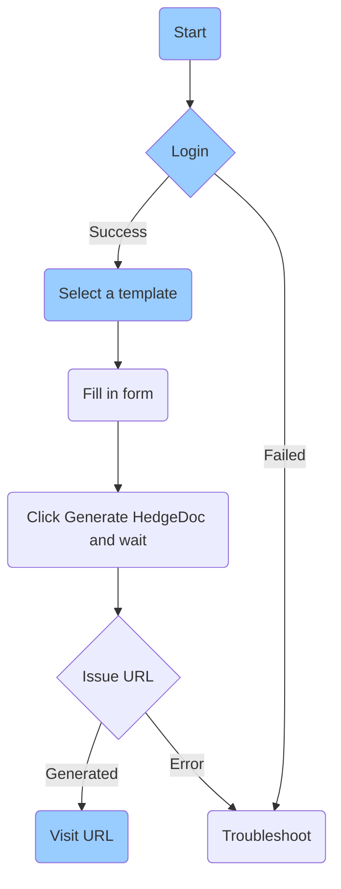

# VM creation

Below lists basic user flow for creating a VM.

```mermaid
graph TD;
   
   1(Start)-->2{Login}
   2 --Success--> 3(Select a template)
   2 --Failed--> 4(Troubleshoot) 
   3 -->5(Fill in form)
   5 -->6(Click Generate HedgeDoc and wait)
   6 -->7{Issue URL}
   7 --Generated-->8(Visit URL)
   7 --Error-->4
   click 1 "https://fitsm.pages.sigma2.no/SRM/templates/meeting-minutes-template.html"
   click 2 "https://fitsm.pages.sigma2.no/SRM/tutorials/howto-login.html"
   click 3 "https://fitsm.pages.sigma2.no/SRM/tutorials/howto-use-templates.html"
   click 8 "https://fitsm.pages.sigma2.no/SRM/tutorials/howto-robot-issue.html"
   classDef highlight fill:#99ccff;
   classDef white fill:#ffffff;
   class 1,2,3,8 highlight;
    
```